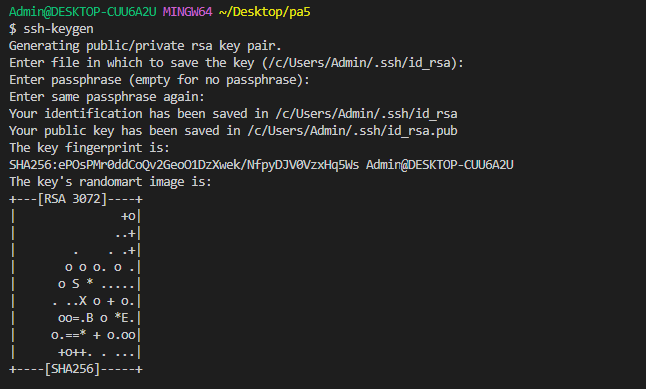
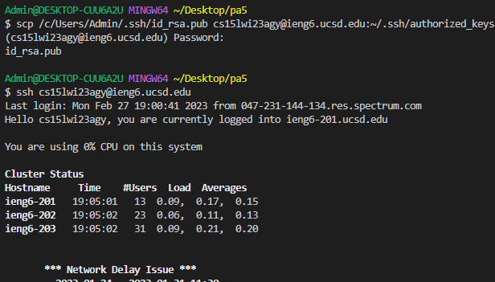

*Lab Report 4*

In this week lab, we are doing some Command-Line Setup and faster than before

*Step 4*

In our local terminal we can run *ssh-keygen* and keep entering <Enter>, then we can see an command completes and shows the “randomart image”. We need to check where our ssh key saved in which director and run *scp <path to your public SSH key> cs15lwi23__@ieng6.ucsd.edu:~/.ssh/authorized_keys* and type our password again.
  
Next time when you login in to ieng6 account, you will found out we don't need password anymore!
  
  

  

*Step 5*
 

