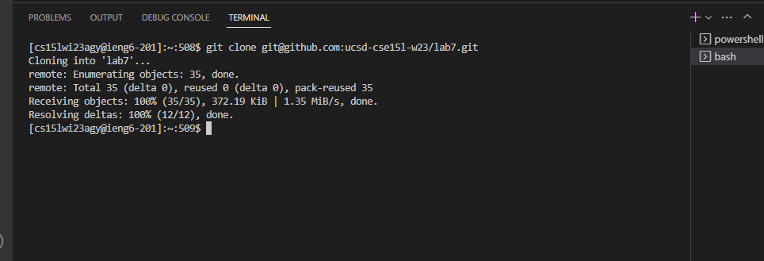
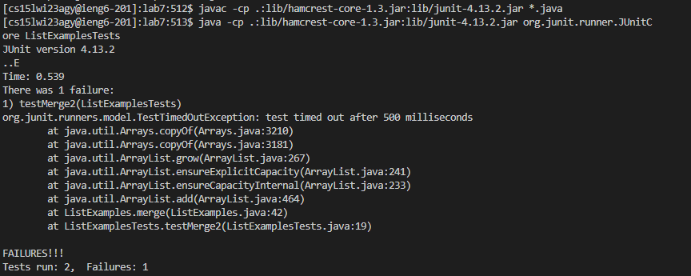
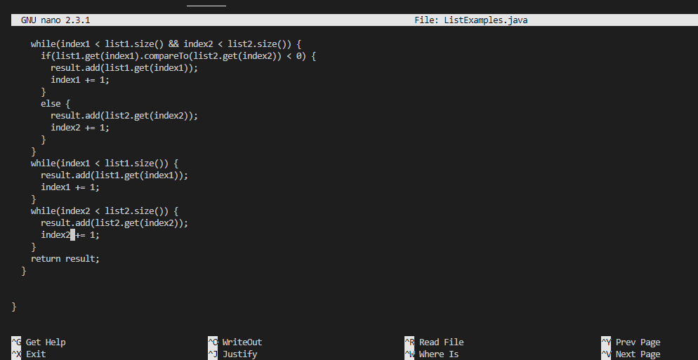
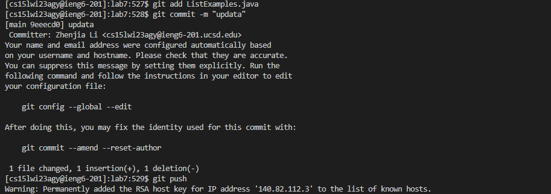

*Lab Report 4*

In this week lab, we are doing some Command-Line Setup and faster than before

*Step 4*

In our local terminal we can run *ssh-keygen* and keep entering <Enter>, then we can see an command completes and shows the “randomart image”. We need to check where our ssh key saved in which director and run *scp <path to your public SSH key> cs15lwi23__@ieng6.ucsd.edu:~/.ssh/authorized_keys* and type our password again.
  
Next time when you login in to ieng6 account, you will found out we don't need password anymore!
  
  

  

*Step 5*
  
After we Set up *SSH* key for Github, we can simply clone and fork the repository by using it's ssh link.
  

  
  
*Step 6*
  
We run the test cases by compile and run Junit, we find out there is one error in our implementation
  

  
*Step 7*

I'm using *nano* command to editor the java file, and i find the error which is when we compare index2 with length of list2, we increment wrong index1 instead index2

  
*Step 8*
  
After i fixed the java code, now we pass all the test case when we run Junit

  
*Step 9*
  
We use *git commit -m* to commit the branch with any messages we want to use, then use git push to pushing changes to the remote makes your commits accessible to others who you may be collaborating with.
  

 

